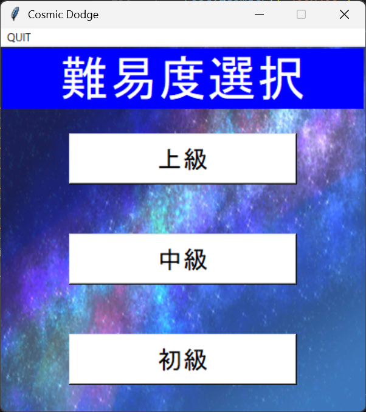
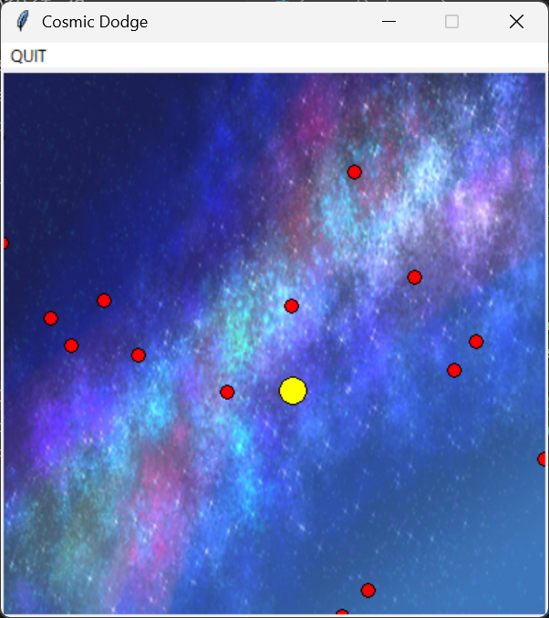
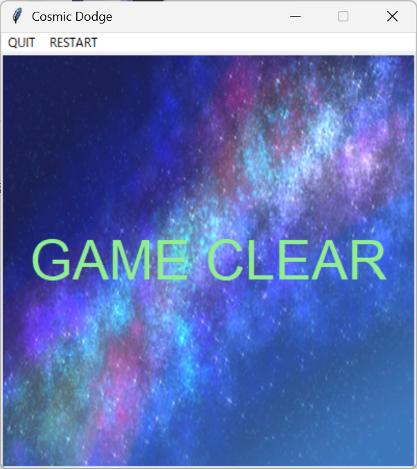
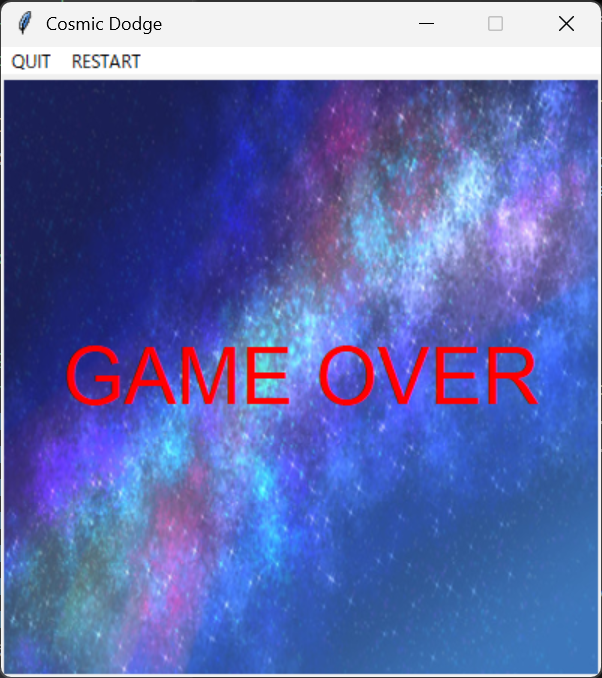

# Cosmic Dodge

## 本アプリについて
本アプリは、私が Git や GitHub の使用方法を学ぶ前に開発したものであるため、コミット履歴がほとんど残っていません。  
当時はローカル環境で開発しており、今回ポートフォリオとして整理・公開するにあたって GitHub にまとめました。  
このアプリ以外は開発初期から Git を活用するようにしており、履歴も含めて管理しています。

## 概要  
シンプルな2D回避アクションゲームです。黄色い球体を操作し、赤い球体の敵から10秒間逃げ切るとゲームクリアです。三段階の難易度が用意されており、難易度によって赤い球体の数と速度が変化します。

## 使用技術  
- 言語：Python
- GUIライブラリ：tkinter 
- 標準モジュール：random（敵の初期位置と移動角度をランダム化）   

## 遊び方  
- 難易度を選択し、黄色い球体をドラッグ操作で動かして赤い球体の敵を避けます。  
- 10秒間当たらずに逃げ切ればクリア。赤い球体に当たるとゲームオーバーとなります。

## 工夫した点  
- 敵の初期位置や移動方向をランダムに設定し、毎回異なる動きを実現。
- 画面端での反射処理により、敵の動きを画面内に保ち、安定した挙動を維持。
- 難易度によって敵の数や速度を調整し、多様なプレイヤー層に対応。
- tkinterのCanvasで描画・操作を行い、直感的にドラッグ操作を可能に。
- コード内に詳しいコメントを記述し、後からの修正や理解をしやすくした（メンテナンス性の向上）。

## 学んだこと  
- tkinterでGUI画面の作成や操作を実際に経験し、基本的な使い方を理解できた。
- 敵の動きにランダム性を加えることで、ゲームに毎回違った展開が生まれることを実感した。
- 開発中に詳細なコメントを多く残すことで、後からコードを見返した際に理解しやすくなることを実感した。

## プレイ画像

| 難易度選択画面       | プレイ中画面         |
|------------------|------------------|
|  |  |

| ゲームクリア画面       | ゲームオーバー画面     |
|------------------|------------------|
|  |  |

## プレイ動画
以下のプレイ動画は、リポジトリ内の `.mp4` ファイルへのリンクとなっています。  
GitHub などの環境によっては、動画が直接再生されず、ダウンロードが必要な場合があります。  
リンクをクリックして、ファイルを保存・再生してください。  
また、動画内で表示されるカーソルは本来と少し位置にずれが生じてしまっています。

| 難易度 | 動画 |
|--------|------|
| 初級 | [初級プレイ動画（ダウンロード）](./media/beginner.mp4) |
| 中級 | [中級プレイ動画（ダウンロード）](./media/intermediate.mp4) |
| 上級 | [上級プレイ動画（ダウンロード）](./media/advanced.mp4) |

